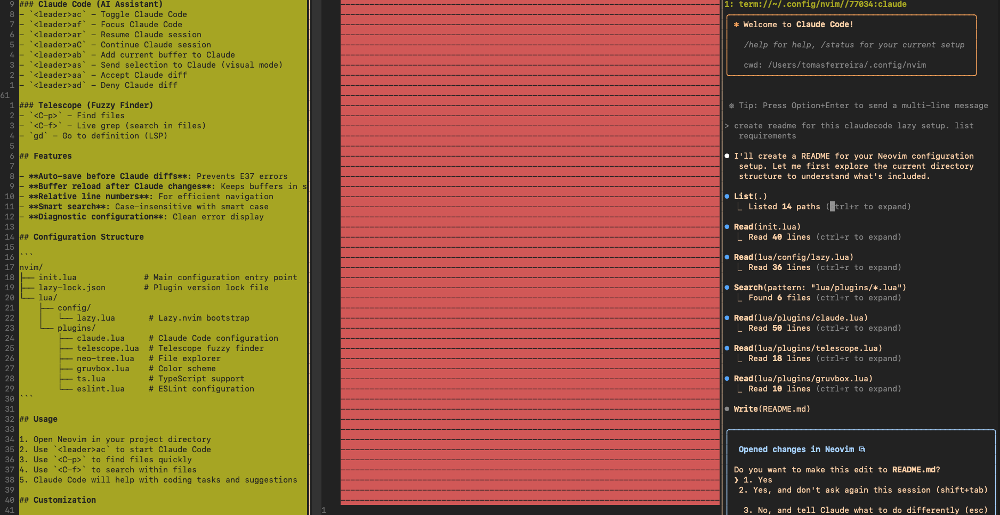

# Neovim Configuration with Lazy.nvim and Claude Code

A minimal Neovim configuration using Lazy.nvim package manager with Claude Code integration for AI-assisted coding.



## Requirements

- **Neovim**: v0.9+ (for Lazy.nvim compatibility)
- **Git**: Required for cloning plugins
- **Claude Code CLI**: For AI integration functionality
- **Node.js**: Required for TypeScript/ESLint support
- **Ripgrep**: For Telescope live grep functionality

### Optional Dependencies

- **fd**: For faster file finding with Telescope
- **A Nerd Font**: For proper icon display in Neo-tree

## Installation

1. **Clone this configuration:**
   ```bash
   git clone <your-repo-url> ~/.config/nvim
   ```

2. **Install Claude Code CLI:**
   ```bash
   npm install -g @anthropic-ai/claude-code
   ```

3. **Start Neovim:**
   ```bash
   nvim
   ```
   
   Lazy.nvim will automatically install all plugins on first launch.

## Included Plugins

- **Lazy.nvim**: Plugin manager
- **Claude Code**: AI-powered coding assistant
- **Telescope**: Fuzzy finder
- **Neo-tree**: File explorer
- **Gruvbox**: Color scheme
- **TypeScript**: Language support
- **ESLint**: Linting support

## Key Mappings

### Leader Key
- `<Space>` - Leader key

### Claude Code (AI Assistant)
- `<leader>ac` - Toggle Claude Code
- `<leader>af` - Focus Claude Code
- `<leader>ar` - Resume Claude session
- `<leader>aC` - Continue Claude session
- `<leader>ab` - Add current buffer to Claude
- `<leader>as` - Send selection to Claude (visual mode)
- `<leader>aa` - Accept Claude diff
- `<leader>ad` - Deny Claude diff

### Telescope (Fuzzy Finder)
- `<C-p>` - Find files
- `<C-f>` - Live grep (search in files)
- `gd` - Go to definition (LSP)

## Features

- **Auto-save before Claude diffs**: Prevents E37 errors
- **Buffer reload after Claude changes**: Keeps buffers in sync
- **Relative line numbers**: For efficient navigation
- **Smart search**: Case-insensitive with smart case
- **Diagnostic configuration**: Clean error display

## Configuration Structure

```
nvim/
├── init.lua              # Main configuration entry point
├── lazy-lock.json        # Plugin version lock file
└── lua/
    ├── config/
    │   └── lazy.lua       # Lazy.nvim bootstrap
    └── plugins/
        ├── claude.lua     # Claude Code configuration
        ├── telescope.lua  # Telescope fuzzy finder
        ├── neo-tree.lua   # File explorer
        ├── gruvbox.lua    # Color scheme
        ├── ts.lua         # TypeScript support
        └── eslint.lua     # ESLint configuration
```

## Usage

1. Open Neovim in your project directory
2. Use `<leader>ac` to start Claude Code
3. Use `<C-p>` to find files quickly
4. Use `<C-f>` to search within files
5. Claude Code will help with coding tasks and suggestions

## Customization

Edit files in `lua/plugins/` to customize individual plugins or add new ones. The configuration uses Lazy.nvim's modern plugin specification format.